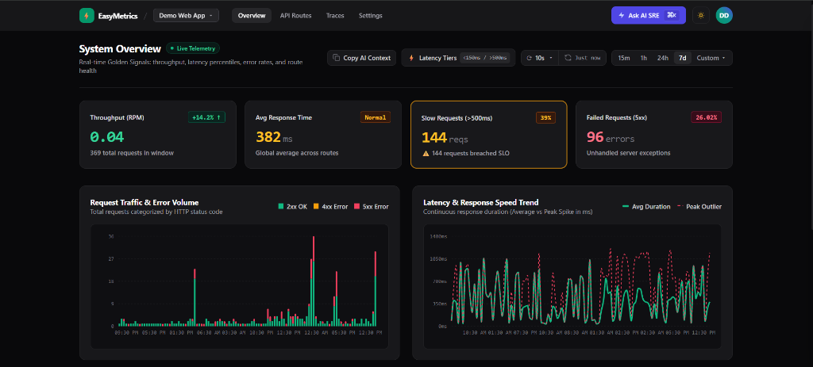
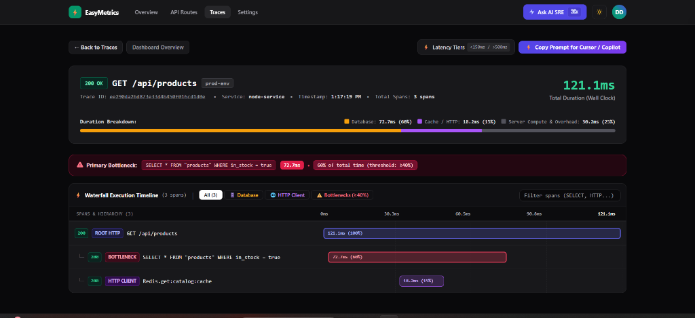
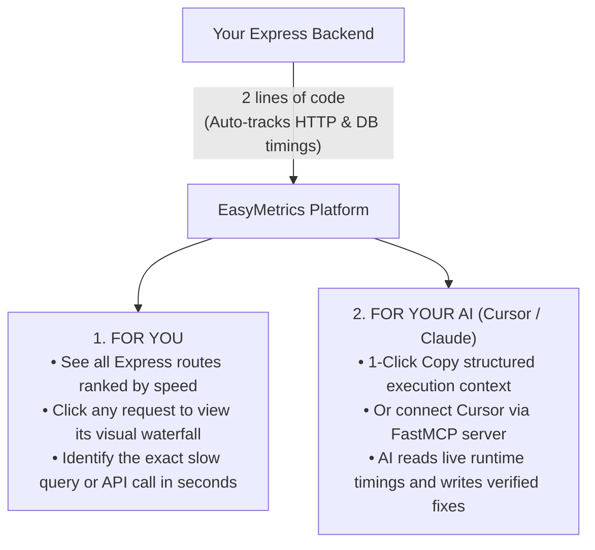
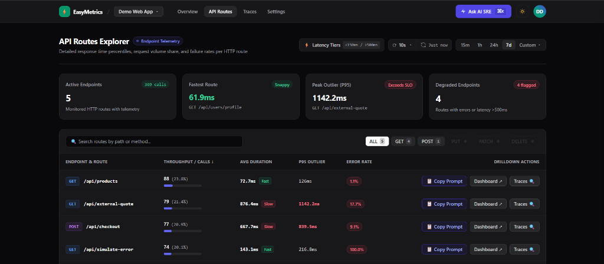
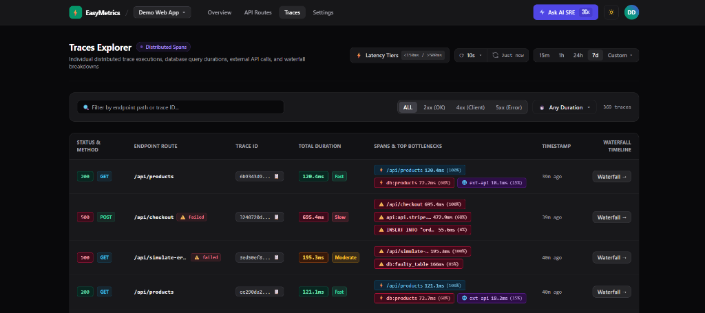
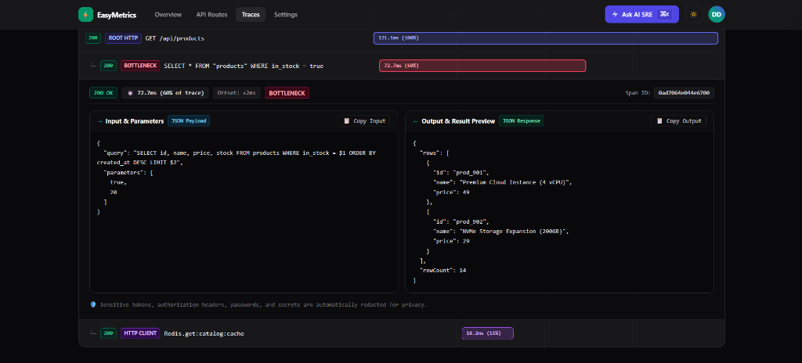

<div align="center">

# ⚡ EasyMetrics

### See Exactly Which Database Query or API Call is Slowing Down Your Express Backend

[](https://github.com)
[](LICENSE)
[](https://nodejs.org/)
[](https://expressjs.com/)
[](CONTRIBUTING.md)

<p align="center">
  EasyMetrics automatically tracks how long each internal part of your Express routes takes to execute—from database queries with multiple JOINs to third-party payment calls.<br/>
  It gives <b>you</b> a visual waterfall timeline for every request, and gives your <b>AI assistant (Cursor / Copilot / Claude)</b> the exact runtime performance data needed to fix slow endpoints without guessing.
</p>

</div>

---

### 📊 Real-Time Route Latency Overview


### 🔍 Request Execution Waterfall


---

## 🛑 The Problem: When an API is Slow, Which Part is Causing the Delay?

Suppose you have an Express route like `POST /api/orders/checkout`.

A single route doesn't do just one thing. It executes an entire chain of operations:
1. **Runs authentication & validation middleware**
2. **Executes a SQL query with multiple JOINs** (e.g., joining `orders`, `users`, and `inventory`)
3. **Calls an external Payment Gateway** (e.g., Stripe API)
4. **Executes an UPDATE query** to record the transaction
5. **Calls a third-party Email/SMS service**
6. **Serializes and returns the response**

Now suppose a user complains that this checkout endpoint took **2.8 seconds** to respond.

Even if you write logs to a file or watch your terminal, all your log tells you is:
```
POST /api/orders/checkout - 200 OK (2840ms)
```

**You are completely blind to which specific step took the time:**
* Was Stripe's API having latency issues?
* Did the database query with multiple JOINs take 2.5 seconds because of a missing index on a large table?
* Did the email service timeout?
* Did the database lock on the UPDATE query?

Unless you measure each individual line, you cannot tell from the outside which part is slow.

---

## 🤖 Why Your AI Coding Assistant Can't Fix This Alone

Most developers today write code using AI tools like **Cursor**, **GitHub Copilot**, or **Claude**.

When your checkout route is slow and you ask your AI: *"Why is this route taking 2.8 seconds?"*, **the AI is forced to guess**:

### 1. AI Only Sees Static Code
An AI reads code files. It can see your SQL query with JOINs, but it has no idea whether that query took **15 milliseconds** or **2,500 milliseconds** when it actually ran against your database.

### 2. Shot-in-the-Dark Suggestions
Because it doesn't know where the time was spent, the AI often suggests irrelevant JavaScript optimizations (like rewriting an array loop or adding memoization) that only save 0.2ms, completely missing the 2.5-second database bottleneck.

### 3. The `console.time()` Logging Cycle
To find out where the delay is, the AI's default workaround is to litter your codebase with timing statements:
```typescript
console.time('db-query');
const order = await db.query('SELECT ... JOIN ...');
console.timeEnd('db-query');

console.time('stripe-call');
await stripe.charges.create(...);
console.timeEnd('stripe-call');
```

This creates a painful, repetitive cycle:
* **Pollutes your clean code and Git history** with temporary debug statements.
* **Wastes your AI context window and tokens** copying terminal outputs back and forth into the chat.
* **Temporary fix**: Once those logging statements are cleaned up, all your visibility is gone. The next time an endpoint slows down in production or staging, you have to repeat the entire logging cycle all over again.

---

## 💡 How EasyMetrics Solves This

EasyMetrics gives you complete runtime clarity without modifying your business logic or adding temporary console statements:



---

### 1. Visual Request Waterfall (For Developers)

Instead of guessing or adding console timers, you click on any slow request in the EasyMetrics dashboard and see a clear visual timeline:

```
POST /api/orders/checkout (Total: 2,840ms)
├── 1. Auth Middleware ..................................... [12ms]   ✅
├── 2. SELECT * FROM orders JOIN items ... (DB Query) ...... [2,480ms] ❌ (Bottleneck: Missing index)
├── 3. POST https://api.stripe.com/v1/charges .............. [310ms]  ✅
└── 4. UPDATE orders SET status = 'paid' ................... [38ms]   ✅
```

You immediately see that the **database query with JOINs took 2,480ms**, while Stripe took only 310ms. You instantly know where to focus your effort.

---

### 2. Runtime Context for Your AI (Cursor / Claude / Copilot)

EasyMetrics gives your AI the runtime execution data it needs so it stops guessing:

* **Method A: 1-Click Copy Context**: Click "Copy Context for AI" on any slow request in your dashboard. Paste it directly into your AI chat:
  > *"Here is the runtime execution timeline for `/api/orders/checkout`. The SQL query with JOINs took 2,480ms. Analyze the query and provide the necessary index or rewrite."*
* **Method B: Model Context Protocol (FastMCP)**: Connect Cursor or Claude Desktop directly to EasyMetrics via MCP. Your AI can inspect live request waterfalls in the background while you write code!

---

## 🚀 60-Second Setup in Express

You do **not** need to set up Docker, manage databases, or configure complex infrastructure. The platform is managed—you simply install the npm package in your application.

### Step 1: Get your API Key
Log in to the EasyMetrics dashboard and copy your **Project API Key** (`em_live_...`).

### Step 2: Install the Package
In your Express project:

```bash
npm install @easy-metrics/node
```

### Step 3: Add 2 Lines of Code
Add this at the **very top** of your application entry file (e.g. `server.ts` or `app.js`):

```typescript
import { initEasyMetrics } from '@easy-metrics/node';

// Initialize before importing express or database drivers
initEasyMetrics({
  serviceName: 'my-express-api',
  apiKey: process.env.EASY_METRICS_API_KEY, // 'em_live_your_project_key'
});

import express from 'express';
const app = express();
// ... rest of your normal application code
```

> **Prefer zero code changes?** Preload the package directly via the Node CLI:
> ```bash
> node --import @easy-metrics/node/register server.js
> ```

That's it. Make requests to your Express app, and live response times, database query durations, and execution waterfalls will immediately appear on your dashboard.

---

## 🧠 Connecting Cursor IDE via MCP

Connect **Cursor** directly to EasyMetrics so your AI can inspect live execution waterfalls while you write code:

1. In Cursor, open **Settings &rarr; Features &rarr; MCP &rarr; Add New MCP Server**.
2. Add your EasyMetrics connection:
   ```json
   {
     "mcpServers": {
       "easymetrics": {
         "url": "https://api.easymetrics.dev/mcp/sse",
         "headers": {
           "x-api-key": "em_live_your_project_key"
         }
       }
     }
   }
   ```

3. **Ask Cursor directly in chat:**
   > *"Cursor, check EasyMetrics for recent slow requests on the checkout endpoint. Inspect the execution waterfall and tell me which database query or API call caused the delay."*

Cursor will retrieve the live request timeline, see that the SQL query with JOINs took 2,480ms, correlate it with your local schema file, and write the exact migration or index needed!

---

## 🛡️ Production Safety Guarantees

When adding a monitoring library to your backend, you must be confident it will never impact your users:

* **Zero-Crash Guarantee**: The SDK will **never crash your host application**. If network connectivity drops or the ingestion server is temporarily unreachable, the SDK silently drops telemetry in memory. It never throws unhandled exceptions and never interrupts user traffic.
* **Non-Blocking Performance**: Request timings are recorded in memory in less than $0.05\text{ms}$. A background worker flushes them in small batches every 2 seconds. Your users experience zero latency overhead.
* **Data Security**: Sensitive headers (such as `Authorization` tokens and passwords) are sanitized before transmission.

---

## 🔍 Visual Tour of Features

### ⚡ Route Latency Breakdown
Sort your Express endpoints by average latency, outliers, and request volume to see which routes need attention.


### 📋 Real-Time Request Explorer
Filter requests by status codes (2xx, 4xx, 5xx) and duration thresholds to isolate failing or slow traffic.


### 🔬 Deep Span Inspector
Drill into individual operations within a request to inspect raw database statements, parameters, and error stack traces.


---

## 🛠️ Want to Contribute or Run Locally?

If you want to:
* Explore the monorepo architecture (`packages/sdk`, `apps/api`, `services/ai-agent`, `apps/web`)
* Run the entire platform locally with Docker Compose and PostgreSQL
* Run the automated test suites (**27 tests across Vitest & Pytest**)
* Understand the environment variables (`.env`)
* Submit a pull request or add a feature

👉 **Read our [CONTRIBUTING.md](CONTRIBUTING.md) guide for full developer setup instructions!**

---

## 📄 License

EasyMetrics is open-source software licensed under the **[MIT License](LICENSE)**.
